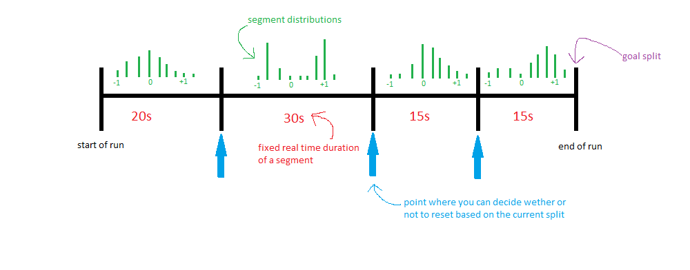

# Speedrun Reset Optimization

This project implements an algorithm for optimising reset strategies in speedrunning.
This is not only useful for determining when to reset during a run, but also it allows you to quantitatively judge when to go for a risky strategy or for a more safe one.

As far as I know this algorithm was first discovered by github user jasontrigg0 as seen at the very bottom of [this](https://www.reddit.com/r/speedrun/comments/lxq9g7/looking_for_a_mathematicaly_perfect_way_to_reset/) thread and in [this](https://gist.github.com/jasontrigg0/148a58ea7533c1831cef605095dbd213) github gist.
I independently rediscovered the algorithm and wrote it out before discovering this.
(I found the thread earlier, but I never scrolled all the way to the bottom.)
This code is hopefully easier to use, easier to understand and faster than jason's.

## The basic idea

Before we can describe the algorithm we need to establish how exactly we model speedrunning.

### A speedrun model

First we split the run up into a fixed number of *segments*.
Associated to a segment are two different types of time.
We have *real time*, the time spent in real life performing a run.
And we have *in game time*, the time in the game that you wish to minimize.
If you are halfway through a run, the sum of the in game duration of the previous segments is called your current *split*.
Often these splits are measured relative to a different run so that these numbers are smaller.

For simplicity we assume that each segment takes some fixed amount of real time.
This is a pretty good approximation for optimized runs as then the real time spent during a run doesn't vary much compared to the full run length.
This approximation cannot be made for the in game time duration.

For each segment we give a probability distribution for the in game time that the segment takes, called the *segment distribution*.
In order to not have our measly finite computers to not explode we discretize time to some fixed precision (in the code this is called the `split_step`).
Finally we have a *goal split*: A split at the end of the run that we want to go below.
This is (somewhat crudely) visualized in the image below.

All of this data together forms a *speedrun model*.
The class `BasicSpeedrunModel` stores all of this data.

Note that not all speedruns can be moddeld by this.
For example in a minecraft speedrun there are many more factors than your current split that weigh into the decision wether or not to reset.
Celeste is an example of a game that is modelled very well by this model.
It is divided into segments that are completely independent of each other.

### Record density
A *reset strategy* is a sequence splits, one for the end of each segment, where you reset at the end of a segment if your current split is higher than the one in the sequence.
Our goal is to find an optimal reset strategy, but what do we mean by optimal?
The goal of speedrunning is to reach a goal split as fast as possible, so we need to minimize the expected amount of real time it takes to reach the goal time.
Actually it will be easier to think of 1 divided by this quantity: the *record density*.
Loosly speaking, the record density is the amount of records per unit real time of an infinite chain of runs.

Calculating the record density of a reset strategy is relatively easy:
Calculate the probability of a single run reaching the end and reaching the goal split and divide it by the expected amount of real time that a single run lasts.
Why exactly this works is a probability theory question that is answered in the non-existant LaTeX document that I intend on writing.

### The algorithm

Suppose that we have managed to find a reset strategy with record density `rd_0`.
We will describe an algorithm for finding a better reset strategy if it exists.

Imagine that you are currenly performing an infinite number of runs using this strategy.
Suppose that you are at the border between the last and the second to last segment with a split of `s`.
Using the split distribution of the last segment we can calulate the the probability `p_record` that you obtain a record in the next segment.
Let `t` be the real time duration of the last segment.
If `p_record/t >= rd_0` the remaining segment on it's own will have a record density higher (or equal to) that of the infinite number of runs that are to come, so continuing will improve the overall record density.
If `p_record/t <= rd_0` then the remaining segment on it's own will have a lower record density than the runs to come, so continuing would decrease the overall record density.
Therefore it is better to reset.
We can repeat this calculation for each possible split and find the smallest split where this process tells us to reset and store this as the last item of a new reset strategy.
(Actually you can find this split using binary search.)

Now we can repeat this to compute reset splits from the back to the front for a new strategy:
For each possible split at the `n`'th segment calculate the record density of the remaining segments when using the reset splits that were just found.
Then take the reset split for the `n`'th segment to be the smallest split that gives a record density stricly smaller than `rd_0`.
How exactly we calculate the probabilities is not important, but it is interesting to note that all of the heavy duty probability calculations can be phrased in terms of convolutions and the numpy library has implemented algorithms to compute these crazy fast.

The resulting reset strategy will have a record density of `rd_1` bigger than `rd_0`.
The idea of the full algorithm is to repeat this process over and over again giving a sequence of decreasing record densities that hopefully stabilizes.
In practice it takes around 3 or 4 iterations to converge to an optimal record density.

I intend on explaining this algorithm and why it converges to an optimal solution in more mathematical rigour in a LaTeX document.
In the meanwhile look at the bottom of [this](https://www.reddit.com/r/speedrun/comments/lxq9g7/looking_for_a_mathematicaly_perfect_way_to_reset/) reddit thread for an explanation.
I have compared early versions of the code to simulations to see if the resulting strategy has the record density the code claims it has and the results matched.
However I will not deny that there is a real possibility of there still being bugs.

## Example applications

The obvious application is to use the optimal reset strategy during a run.
The calculated expected record time could be used to estimate how long it will take to obtain a record, however this might have some unwanted psychologial effects.
A much more interesting application is the comparison of strategies and routes.

Another example is Cannonless in the Super Mario 64 16 start category.
Cannonless is a strategy to the 'Blast Away the Wall' star in Whomp's Fortress without using the cannon.
This strategy saved around 30 seconds over using the cannon at the cost of only working about 20% of the time.
This meant that a lot of runs where reset at this point in the run.
Then Sockfolder found a setup for this trick that made the strategy 100% consistent at the cost of about 10 seconds.
(This was later lowerd to 6 seconds)
Despite the time loss the consistency made the strategy worth it.
However when the record went lower and lower timesaves where harder to find.
As a result runners started using the original inconsistent strategy again.
(See [this](https://www.youtube.com/watch?v=R_wscUcbynk) video by Summoning Salt.)
How do we make this exact?
When is a fast risky strategy better than a slow consistent strategy?
By making a speedrun model for each strategy we can compare the record densities for different goal splits.
We see that for higher goal times the consistent strategy gives a lower optimal record density than, but for lower goal times the risky strategy gives the best record density.
This is illustrated in the `example2` function of `example_code.py`.

The `example1` function of `example_code.py` illustrates the intuitively obvious fact that risky strategies are worse later in a run than in the beginning.

## Getting started

At the moment this project consists of just python code and cannot really be compiled in any way.
All the python code is contained in the PyCharm project ResetOptimizationCode.
The full algorithm is contained in the files `speedrun_models.py` and `reset_strategies.py`.
Only the numpy library is needed to run the code.

The hardest thing about modelling a speedrun is finding the segment distributions.
The file `lss_reader.py` has the class LSSReader that allows you to easily gather data from .lss-files (LiveSplit splits files).
See the example file `celeste_example.py`.

## Room for improvement
- Models are only models.
The definition of a speedrun model can be improved in many ways while still keeping an algorithm for finding an optimal strategy relatively easy.
For example at the end of a segment we could allow the runner to not only decide whether or not to reset, but also to decide which strategy to employ during the next segment.
This would require giving a segment distribution for each strategy.
Another example would be to allow additional variables (like the number of ammo the runner has at the end of a segment) to be taken into account when deciding wether or not to reset. 
- You may have noticed that the `get_strategy` function optionally outputs the probability of getting a record at each point in the run and for each possible split.
It would be kinda cool to have a LiveSplit component that shows this probability given the current segment and split.

If you feel like contributing feel free to email me (the owner of this repository).